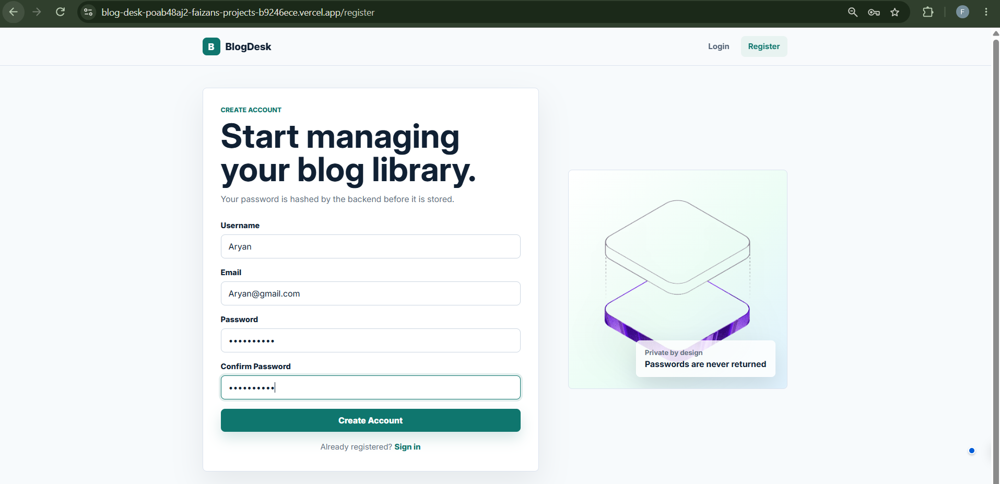
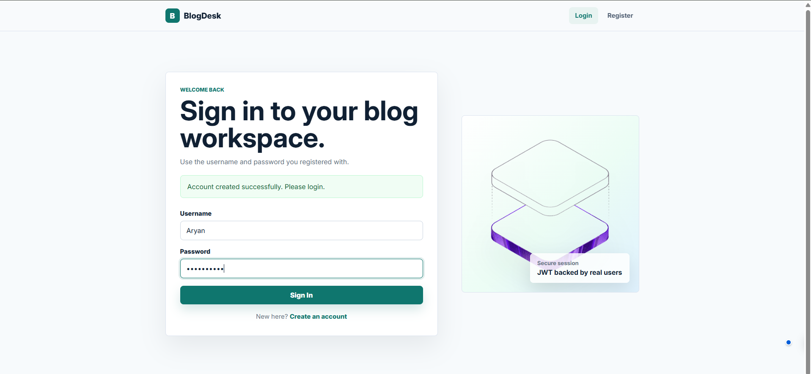
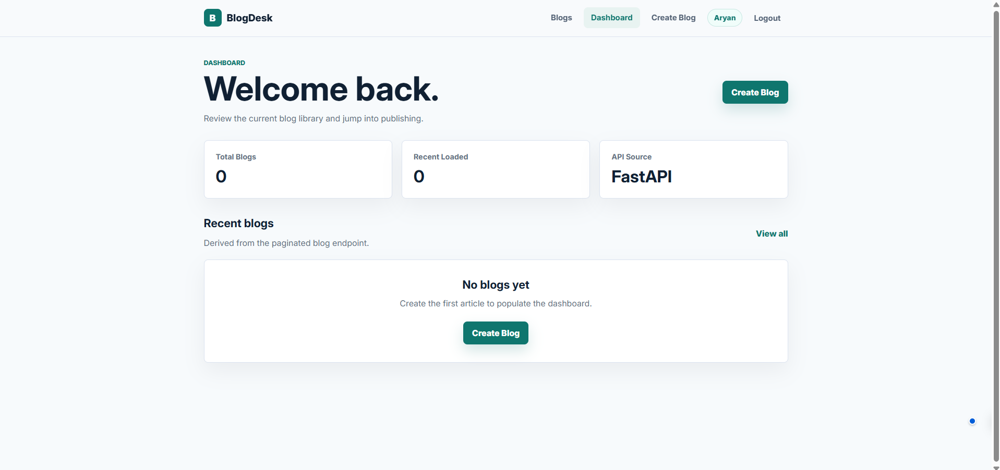
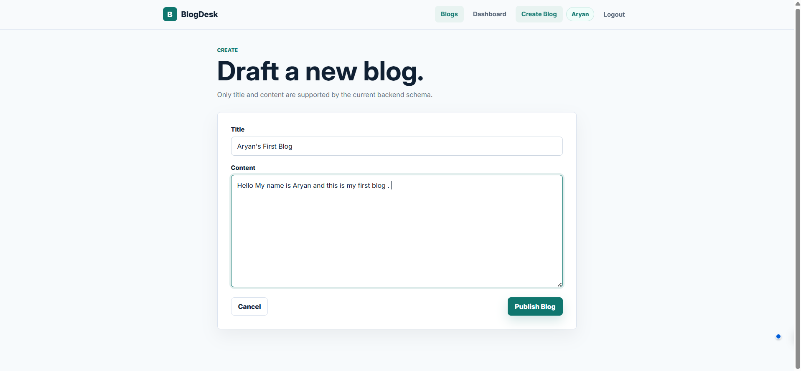
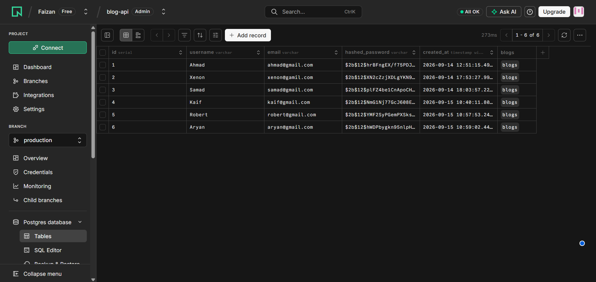

# 📝 BlogDesk 

A full-stack Blog Management Application built with **FastAPI**, **PostgreSQL (Neon)**, **JWT Authentication**, **SQLAlchemy**, **Render**, and **Vercel**.

🔗 Live API: https://blogdesk-obpj.onrender.com  
🔗 Frontend: https://blog-desk-665lvskce-faizans-projects-b9246ece.vercel.app

---

## 🚀 Features

- User Registration
- User Login with JWT Authentication
- Protected Routes
- Create Blog
- Read Blogs
- Update Own Blogs
- Delete Own Blogs
- Search Blogs
- Pagination
- PostgreSQL Database (Neon)
- Render Deployment
- Vercel Frontend Deployment
- CORS Configuration
- Password Hashing using Bcrypt

---

## 🛠️ Tech Stack

### Backend
- FastAPI
- SQLAlchemy
- PostgreSQL
- Neon Database
- JWT Authentication
- Bcrypt
- Uvicorn

### Frontend
- React
- Axios
- Vercel

### Deployment
- Render
- Neon
- Vercel

---

## 📂 Project Structure

```text
BLOG API
│
├── main.py
├── database.py
├── models.py
├── schemas.py
├── auth.py
├── config.py
├── requirements.txt
├── .env
│
└── screenshots/
```

---

# 📸 Application Screenshots

## 1️⃣ User Registration



Users can create a new account using username, email, and password.

---

## 2️⃣ User Login



JWT token is generated after successful login.

---

## 3️⃣ Dashboard



Displays all available blogs with pagination and search functionality.

---

## 4️⃣ Create Blog



Authenticated users can create new blogs.

---

## 5️⃣ Neon PostgreSQL Database



Blog and user data are stored in Neon PostgreSQL.

---

# 🔐 Authentication Flow

### Register

```http
POST /register
```

### Login

```http
POST /login
```

Response:

```json
{
  "access_token": "JWT_TOKEN",
  "token_type": "bearer"
}
```

### Protected Routes

```http
Authorization: Bearer <JWT_TOKEN>
```

---

# 📚 API Endpoints

## Authentication

| Method | Endpoint | Description |
|----------|----------|----------|
| POST | /register | Register User |
| POST | /login | Login User |
| GET | /me | Current User |

---

## Blogs

| Method | Endpoint | Description |
|----------|----------|----------|
| POST | /blogs | Create Blog |
| GET | /blogs | Get All Blogs |
| GET | /blogs/{id} | Get Single Blog |
| PUT | /blogs/{id} | Update Blog |
| DELETE | /blogs/{id} | Delete Blog |

---

# 🔍 Pagination Example

```http
GET /blogs?page=1&limit=5
```

---

# 🔎 Search Example

```http
GET /blogs?search=fastapi
```

---

# 🗄️ Database

### Users Table

| Column | Type |
|----------|----------|
| id | Integer |
| username | String |
| email | String |
| hashed_password | String |

### Blogs Table

| Column | Type |
|----------|----------|
| id | Integer |
| title | String |
| content | Text |
| user_id | Integer |

---

# 🌐 Deployment

### Backend (Render)

```bash
https://blogdesk-obpj.onrender.com
```

### Frontend (Vercel)

```bash
https://blog-desk-665lvskce-faizans-projects-b9246ece.vercel.app
```

### Database (Neon)

```bash
PostgreSQL Database hosted on Neon
```

---

# ⚙️ Environment Variables

```env
DATABASE_URL=your_neon_database_url

JWT_SECRET_KEY=your_secret_key

JWT_ALGORITHM=HS256

JWT_EXPIRE_MINUTES=30

CORS_ORIGINS=http://localhost:5173,https://your-vercel-app.vercel.app
```

---

# ▶️ Run Locally

Clone the project

```bash
git clone https://github.com/Faizan0602/blog-api.git
```

Navigate into project

```bash
cd blog-api
```

Create virtual environment

```bash
python -m venv venv
```

Activate virtual environment

```bash
venv\Scripts\activate
```

Install dependencies

```bash
pip install -r requirements.txt
```

Run server

```bash
uvicorn main:app --reload
```

---

# 📈 Learning Outcomes

Through this project I learned:

- FastAPI Fundamentals
- REST API Design
- JWT Authentication
- Password Hashing with Bcrypt
- SQLAlchemy ORM
- PostgreSQL Integration
- Neon Database
- Render Deployment
- Vercel Deployment
- CORS Configuration
- API Testing using Swagger UI

---

## 👨‍💻 Author

**Faizan**

Aspiring AI Engineer | Python Developer | FastAPI Enthusiast

GitHub: https://github.com/Faizan0602

LinkedIn: https://www.linkedin.com/in/faizan0602

---
⭐ If you found this project useful, consider giving it a star.
